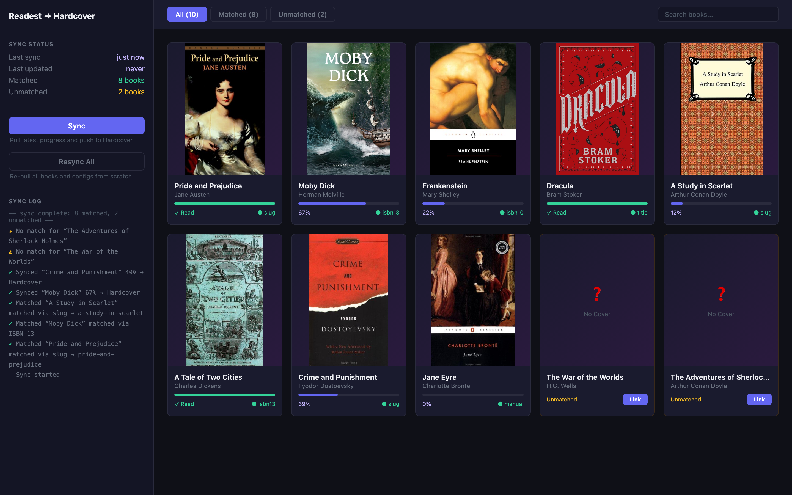
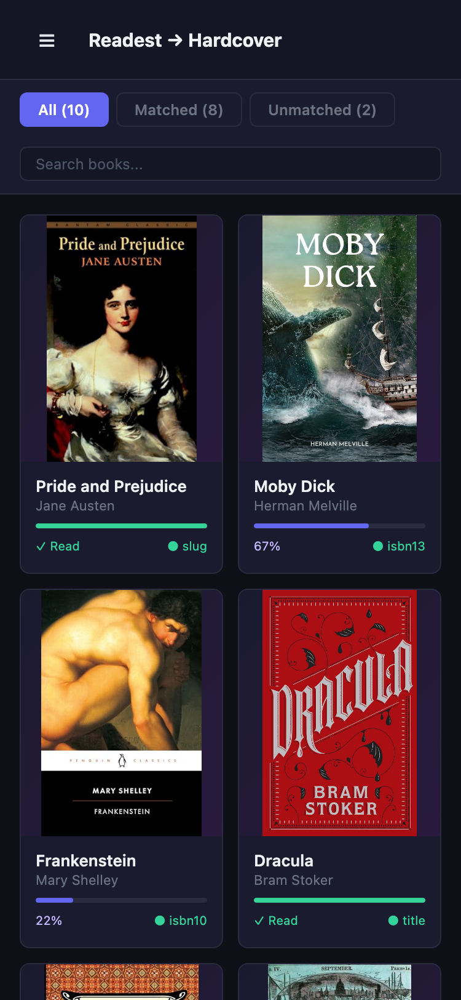

# readest-hardcover-sync

Syncs reading progress from [Readest](https://readest.com) to [Hardcover.app](https://hardcover.app). One-direction only: Readest → Hardcover.

The service polls Readest's cloud for book and progress changes, matches them to Hardcover books, and updates your reading status and page progress.

## How it works

1. Polls Readest's sync API every 10 minutes for books and reading progress
2. Matches each book to Hardcover using a fallback chain: Hardcover slug → ISBN-13 → ISBN-10 → title search
3. Updates your Hardcover reading status and page progress
4. Books that can't be auto-matched appear in the web UI for manual linking

## Setup

### Prerequisites

- A Readest account with cloud sync enabled
- A Hardcover API token (get one at https://hardcover.app/account/api)

### Environment variables

| Variable             | Required | Default      | Description                                                                                     |
| -------------------- | -------- | ------------ | ----------------------------------------------------------------------------------------------- |
| `READEST_EMAIL`      | yes      |              | Your Readest account email                                                                      |
| `READEST_PASSWORD`   | yes      |              | Your Readest account password                                                                   |
| `HARDCOVER_TOKEN`    | yes      |              | Hardcover API token (may include "Bearer " prefix)                                              |
| `PUBLIC_BASE_URL`    | no       |              | Public web UI URL used for notification links                                                   |
| `SLACK_WEBHOOK_URL`  | no       |              | Slack incoming webhook URL. Requires `PUBLIC_BASE_URL` when set                                 |
| `SYNC_INTERVAL`      | no       | `10m`        | How often to poll Readest                                                                       |
| `LISTEN_ADDR`        | no       | `:8080`      | Web UI listen address                                                                           |
| `STATE_FILE`         | no       | `state.json` | Path to the state file                                                                          |
| `ENABLE_TITLE_MATCH` | no       | `false`      | Allow matching books by title search (may produce false matches)                                |
| `MANUAL_SYNC`        | no       | `false`      | If true, poll and match books but don't write to Hardcover until you click "Sync" in the web UI |
| `COVERS_DIR`         | no       | `covers`     | Directory for cached book cover images                                                          |
| `MIN_SYNC_PERCENT`   | no       | `2`          | Minimum progress % before syncing a book as "currently reading"                                 |
| `MIN_SYNC_PAGES`     | no       | `5`          | Minimum Readest pages before syncing (whichever threshold is met first)                         |

### Local development

```bash
# Clone and enter the project
cd readest-hardcover-sync

# Allow direnv (loads nix dev shell)
direnv allow

# Create credentials file
cat > .envrc.local << 'EOF'
READEST_EMAIL=your@email.com
READEST_PASSWORD=your-password
HARDCOVER_TOKEN=your-token
EOF

# Verify credentials
go run ./cmd/readest-hardcover-sync check-readest-auth
go run ./cmd/readest-hardcover-sync check-hardcover-auth

# Optional: verify Hardcover search API response shape when HARDCOVER_TOKEN is set
go test ./internal/hardcover -run LiveContract -count=1 -v

# Start the server in manual sync mode
MANUAL_SYNC=true go run ./cmd/readest-hardcover-sync serve
```

### Docker

```bash
docker build -t readest-hardcover-sync .
docker run -d \
  -e READEST_EMAIL=your@email.com \
  -e READEST_PASSWORD=your-password \
  -e HARDCOVER_TOKEN=your-token \
  -e STATE_FILE=/data/state.json \
  -e MANUAL_SYNC=true \
  -v $(pwd)/data:/data \
  -p 8080:8080 \
  readest-hardcover-sync
```

## Manual sync mode

Set `MANUAL_SYNC=true` for first-time use. In this mode:

- The service still polls Readest and matches books automatically
- Reading progress is tracked locally but **not** pushed to Hardcover
- Open the web UI at `http://localhost:8080` to review matches
- Use the link modal to manually fix any incorrect matches
- Click "Sync" in the sidebar when ready to push to Hardcover

Once you're confident the matching is correct, you can switch to automatic mode by removing `MANUAL_SYNC` or setting it to `false`.

## Notifications

Set `SLACK_WEBHOOK_URL` and `PUBLIC_BASE_URL` to enable Slack notifications. Slack messages link directly back to the book in the web UI and include Hardcover's cover image when one is available. If no cover is available, the message uses the Slack `:question:` emoji.

Slack sends notifications when:

- A new Readest book is discovered, including whether it linked automatically
- A book is marked complete in Hardcover
- A critical sync error occurs, at most once per day per distinct error per service startup

## Web UI

Available at `http://localhost:8080`. Single-page dark-themed interface:





- **Sidebar** — sync status, Sync/Resync All buttons, and a real-time sync log
- **Book grid** — card view with cover images, progress bars, and match badges
- **Detail modal** — click any card to see identifiers, sync state, and actions (View on Hardcover, Relink, Unlink)
- **Filter & search** — filter by All/Matched/Unmatched, search by title, author, or series

Cover images are downloaded from Hardcover and cached locally in `COVERS_DIR`.

**Reverse proxy note:** The sync log uses Server-Sent Events (`/events`). If behind nginx, add `proxy_buffering off;` to the location block.

## CLI commands

| Command                | Description                                                            |
| ---------------------- | ---------------------------------------------------------------------- |
| `serve`                | Start the sync server                                                  |
| `check-readest-auth`   | Verify Readest credentials work                                        |
| `check-hardcover-auth` | Verify Hardcover token works                                           |
| `list-readest-books`   | Pull and display all books from Readest with parsed identifiers        |
| `lookup <slug\|isbn>`  | Look up a book on Hardcover by slug, ISBN-13, or ISBN-10               |
| `dry-run`              | Run one sync cycle without writing to Hardcover (uses temporary state) |
| `demo`                 | Start a demo server with sample data (no credentials needed)           |

## Book matching

Books are matched using identifiers embedded in EPUB metadata. The service tries these in order:

1. **Hardcover slug** — if the EPUB has a `{scheme: "HARDCOVER", value: "slug"}` identifier (added by tools like Booklore)
2. **ISBN-13** — looks up the edition on Hardcover
3. **ISBN-10** — falls back to ISBN-10 lookup
4. **Title search** — (only if `ENABLE_TITLE_MATCH=true`) searches Hardcover by title + author

If no match is found, the book appears as "unmatched" in the web UI for manual linking.
